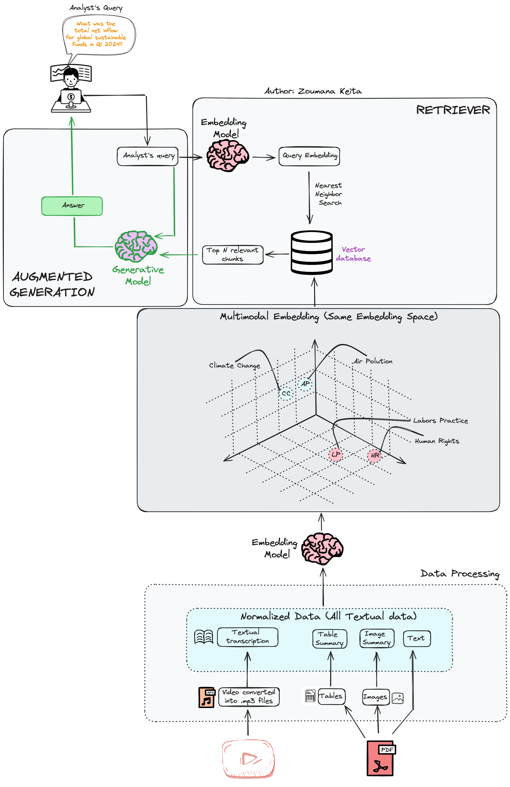

# Multimodal Retrieval Augmented Generation for Sustainable Finance

## Overview

This project implements a Multimodal Retrieval Augmented Generation (RAG) system for ESG (Environmental, Social, and Governance) analysis in emerging markets. It combines text, image, table, and audio data to provide comprehensive insights for financial analysts making strategic investment decisions.

## Workflow

The above image illustrates the end-to-end workflow of our Multimodal RAG system:

1. **Data Processing**: 
   - Raw data (YouTube videos, PDFs) is processed into normalized textual data.
   - Videos are converted to mp3 files and transcribed.
   - PDFs are parsed to extract text, tables, and images.
   - All data is converted into a textual format (transcriptions, summaries, etc.).

2. **Embedding**: 
   - The normalized textual data is passed through an embedding model.
   - This creates a unified embedding space where different data types (climate change, air pollution, labor practices, human rights) can be compared.

3. **Retriever**:
   - When an analyst submits a query, it's embedded using the same model.
   - A nearest neighbor search is performed in the vector database to find the most relevant information.

4. **Augmented Generation**:
   - The top N relevant chunks from the vector database are combined with the original query.
   - This augmented input is passed to a generative model (e.g., GPT-4) to produce a comprehensive answer.

5. **User Interface**:
   - The generated answer is presented to the analyst through a user-friendly interface.

This workflow allows for efficient retrieval and generation of insights across diverse data types, all unified in a single embedding space.

## Features

- Multimodal data processing: Handles PDF documents, images, tables, and audio files
- Retrieval Augmented Generation: Enhances LLM responses with relevant retrieved information
- Vector database integration: Utilizes Weaviate for efficient similarity search
- OpenAI integration: Leverages GPT-4 for natural language understanding and generation
- Streamlit interface: Provides an interactive UI for testing and user feedback

## Prerequisites

- Python 3.7+
- OpenAI API key
- Weaviate Cloud Services account
- FFmpeg (for audio processing)

## Video link
https://www.youtube.com/watch?v=D5iKsvK7cXg

## Medium article
https://medium.com/artificial-corner/multimodal-retrieval-augmented-generation-for-sustainable-finance-with-code-5a910f3b666c
